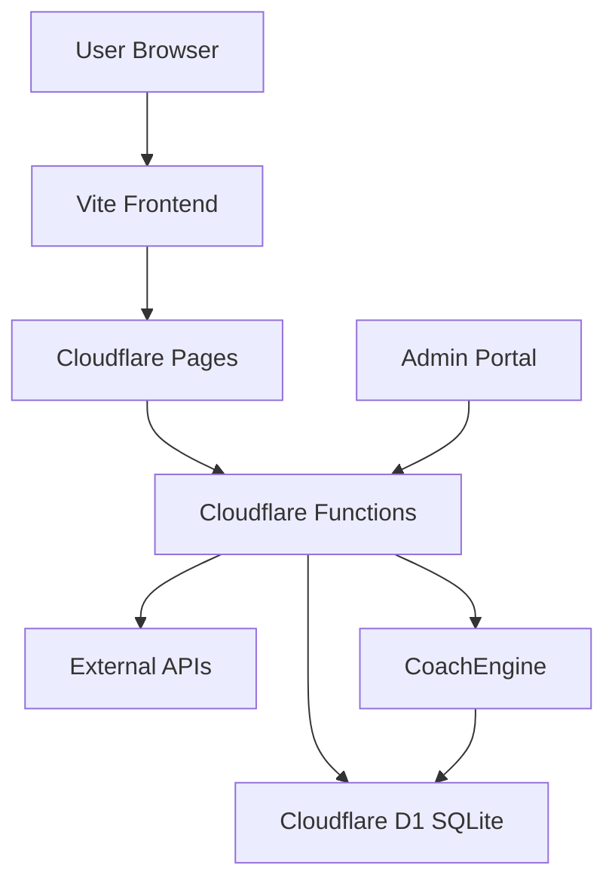

# ChessChatWeb Architecture

**Last Updated**: December 18, 2025  
**Version**: 1.0.0

## Table of Contents

1. [System Overview](#system-overview)
2. [Technology Stack](#technology-stack)
3. [Frontend Architecture](#frontend-architecture)
4. [Backend Architecture](#backend-architecture)
5. [Database Design](#database-design)
6. [Knowledge Vault System](#knowledge-vault-system)
7. [CoachEngine](#coachengine)
8. [Authentication & Security](#authentication--security)
9. [API Design](#api-design)
10. [Deployment Architecture](#deployment-architecture)

## System Overview

ChessChatWeb is a full-stack chess application that combines:
- **Interactive Chess Gameplay** with AI opponents
- **Post-Game Analysis** with AI coaching
- **Knowledge Vault** for chess educational content
- **CoachEngine** for intelligent, self-contained coaching
- **Admin Portal** for system management

### High-Level Architecture



### Design Principles

1. **Serverless-First**: Cloudflare Workers for scalability
2. **Edge Computing**: Global deployment with low latency
3. **Self-Contained Coaching**: No external AI dependency for coaching
4. **Type Safety**: TypeScript throughout
5. **Component-Based**: React with composable components
6. **API-Driven**: Clear separation of concerns

## Technology Stack

### Frontend
- **Framework**: React 18.3.1
- **Build Tool**: Vite 5.4.21
- **Language**: TypeScript 5.6.3
- **Chess Logic**: Chess.js 1.0.0-beta.8
- **State Management**: Zustand 5.0.2
- **Styling**: CSS Modules + Custom CSS
- **Code Splitting**: React.lazy() for performance

### Backend
- **Runtime**: Cloudflare Workers
- **Language**: TypeScript
- **Database**: Cloudflare D1 (SQLite)
- **ORM**: Prisma 6.2.0
- **Functions**: Cloudflare Pages Functions

### Development Tools
- **Package Manager**: npm
- **Linting**: ESLint
- **Development Server**: Vite Dev Server + Mock Backend (Express)
- **Version Control**: Git

## Frontend Architecture

### Component Structure

```
src/
├── components/
│   ├── GameView.tsx           # Main chess board & gameplay
│   ├── PostGameChat.tsx       # AI-powered post-game analysis
│   ├── CoachingPanel.tsx      # CoachEngine insights (Phase 8)
│   ├── AdminPortal.tsx        # Admin authentication & navigation
│   └── admin/
│       ├── SystemHealthTab.tsx
│       ├── KnowledgeVaultTab.tsx
│       ├── AuditLogTab.tsx
│       └── AdminUnlockModal.tsx
├── hooks/
│   └── useCoaching.ts         # CoachEngine hook (Phase 8)
├── store/
│   ├── gameStore.ts           # Game state (Zustand)
│   └── adminStore.ts          # Admin session state
├── lib/
│   ├── api.ts                 # API client
│   └── models.ts              # TypeScript interfaces
└── styles/
    └── *.css                  # Component-specific styles
```

### State Management

**Game State** (`gameStore.ts`):
- Chess board state (Chess.js instance)
- Move history
- Game result
- Chat messages
- Selected AI model
- Analysis state

**Admin State** (`adminStore.ts`):
- Session token
- Authentication status
- Token expiration

### Routing

Single Page Application (SPA) with conditional rendering:
- `/` - Chess game interface
- `/admin` - Admin portal
- No client-side routing library (keeps bundle small)

### Performance Optimizations

1. **Code Splitting**: Lazy-loaded components
   - GameView, PostGameChat, Settings, AboutView
   - Reduces initial bundle size by ~15KB

2. **Asset Optimization**:
   - SVG sprites for chess pieces
   - Minified CSS
   - Tree-shaking with Vite

3. **API Optimization**:
   - Request deduplication
   - Retry logic with exponential backoff
   - Request timeout (25s)

## Backend Architecture

### Cloudflare Functions Structure

```
functions/
├── api/
│   ├── chess/
│   │   ├── move.ts              # AI move generation
│   │   └── analysis.ts          # Game analysis
│   ├── chat.ts                  # Post-game chat
│   ├── health.ts                # Health check
│   └── admin/
│       ├── auth/
│       │   ├── unlock.ts        # Admin login
│       │   └── logout.ts        # Admin logout
│       ├── knowledge/
│       │   ├── sources.ts       # CRUD sources
│       │   ├── sources/
│       │   │   └── [id]/
│       │   │       ├── index.ts # Get/update/delete source
│       │   │       └── chunks.ts # CRUD chunks
│       │   └── diagnostics.ts   # Knowledge stats
│       ├── coach.ts             # CoachEngine endpoint
│       └── audit.ts             # Audit log
├── lib/
│   ├── db.ts                    # Prisma client singleton
│   ├── adminAuthService.ts      # Session management
│   ├── knowledgeService.ts      # Knowledge CRUD
│   ├── coachEngine.ts           # Coaching logic
│   └── auditService.ts          # Audit logging
└── tsconfig.json
```

### Function Execution Model

Each Cloudflare Function is a serverless handler:
1. Request arrives at edge location
2. Function spins up (cold start or warm reuse)
3. Executes TypeScript code
4. Returns response
5. Function may stay warm for subsequent requests

### Database Access

**Prisma Client**:
```typescript
import { getPrismaClient } from '../lib/db';

const prisma = getPrismaClient(env.DB);
const sources = await prisma.knowledgeSource.findMany();
```

**Connection Pooling**: Handled by Cloudflare D1

## Database Design

### Schema (Prisma)

```prisma
// Knowledge Vault
model KnowledgeSource {
  id          String           @id @default(cuid())
  title       String
  sourceType  String
  url         String?
  isDeleted   Boolean          @default(false)
  chunks      KnowledgeChunk[]
  createdAt   DateTime         @default(now())
  updatedAt   DateTime         @updatedAt
}

model KnowledgeChunk {
  id           String          @id @default(cuid())
  sourceId     String
  chunkText    String
  tags         String          // JSON array
  language     String          @default("en")
  source       KnowledgeSource @relation(fields: [sourceId], references: [id], onDelete: Cascade)
  createdAt    DateTime        @default(now())
}

// Admin & Audit
model AdminSession {
  id        String   @id @default(cuid())
  token     String   @unique
  expiresAt DateTime
  createdAt DateTime @default(now())
}

model AuditLog {
  id        String   @id @default(cuid())
  action    String
  target    String
  details   String?  // JSON
  timestamp DateTime @default(now())
}
```

### Indexes

- `KnowledgeSource.isDeleted` - Fast filtering
- `KnowledgeChunk.sourceId` - Foreign key performance
- `AdminSession.token` - Fast auth lookup
- `AuditLog.timestamp` - Chronological queries

## Knowledge Vault System

### Architecture

```
Knowledge Source (e.g., "Chess Tactics")
  ├── Chunk 1: "Pin" (tags: ["tactics", "pin"])
  ├── Chunk 2: "Fork" (tags: ["tactics", "fork"])
  └── Chunk 3: "Skewer" (tags: ["tactics", "skewer"])
```

### Chunk Format

**Markdown-based**:
```markdown
## Pin

A pin is a tactical motif where an attacking piece targets...

**Key Ideas:**
- Absolute pin vs relative pin
- Pinned piece cannot move
- Common in openings
```

### Search Strategy

1. **Full-Text Search**: Match keywords in chunk text
2. **Tag Matching**: Filter by tags (e.g., "tactics", "endgame")
3. **Relevance Scoring**: 
   - Keyword frequency
   - Tag matches
   - Source authority

### Import Process

```bash
scripts/import-knowledge.ts
  ↓
Reads knowledge_seed/*.md files
  ↓
Splits into chunks (## headers)
  ↓
Extracts tags, metadata
  ↓
Creates KnowledgeSource + Chunks in DB
```

## CoachEngine

### Design Philosophy

**Self-Contained Intelligence**: No external AI APIs required for coaching

### Architecture

```
CoachEngine
  ├── searchKnowledge(query)      # Full-text search
  ├── thematicCoaching(theme)     # Theme-based guidance
  └── generateAdvice(context)     # Context-aware coaching
```

### Coaching Flow

```
User completes game
  ↓
PostGameChat component loads
  ↓
CoachEngine analyzes game context
  ↓
Searches Knowledge Vault for relevant content
  ↓
Ranks results by relevance
  ↓
Displays coaching insights + sources
```

### Relevance Scoring Algorithm

```typescript
function scoreChunk(chunk, query, context) {
  let score = 0;
  
  // Keyword matches (case-insensitive)
  const keywords = query.toLowerCase().split(' ');
  keywords.forEach(kw => {
    if (chunk.chunkText.toLowerCase().includes(kw)) {
      score += 10;
    }
  });
  
  // Tag matches
  const tags = JSON.parse(chunk.tags);
  keywords.forEach(kw => {
    if (tags.includes(kw)) {
      score += 20; // Higher weight for tag matches
    }
  });
  
  // Context matching (game phase, themes)
  if (context.gamePhase && tags.includes(context.gamePhase)) {
    score += 15;
  }
  
  return score;
}
```

### Coaching Modes

1. **Search Knowledge**: Direct keyword search
2. **Thematic Coaching**: Pre-defined themes (tactics, opening, endgame)
3. **Generate Advice**: Full game context analysis

## Authentication & Security

### Admin Authentication

**Password-Based**:
- Admin password stored in environment variable
- Session tokens generated on unlock
- 2-hour token expiration
- In-memory session storage (Zustand)

**Security Measures**:
1. No localStorage (prevents XSS token theft)
2. Password transmitted over HTTPS only
3. Session tokens use crypto.randomUUID()
4. Rate limiting (future enhancement)

### API Security

**Authorization**:
```typescript
// Admin endpoints require Bearer token
Authorization: Bearer {token}

// Middleware validates token
if (!verifySession(token)) {
  return res.status(401).json({ error: 'Unauthorized' });
}
```

**CORS**:
```typescript
// Configured in functions/_middleware.ts
Access-Control-Allow-Origin: *
Access-Control-Allow-Methods: GET, POST, PATCH, DELETE
Access-Control-Allow-Headers: Content-Type, Authorization
```

## API Design

### REST Principles

- **Resource-Based URLs**: `/api/admin/knowledge/sources`
- **HTTP Methods**: GET, POST, PATCH, DELETE
- **Status Codes**: 200, 201, 400, 401, 404, 500
- **JSON Payloads**: All requests/responses use JSON

### Endpoint Patterns

**Public Endpoints**:
- No authentication required
- Rate-limited (future)
- Cacheable where appropriate

**Admin Endpoints**:
- Require session token
- Audit logged
- CRUD operations

### Error Handling

**Standard Error Response**:
```json
{
  "error": "Resource not found",
  "code": "NOT_FOUND",
  "details": "Source with ID 'xyz' does not exist"
}
```

## Deployment Architecture

### Cloudflare Pages

**Build**:
```bash
npm run build
  ↓
Vite bundles frontend → dist/
  ↓
Cloudflare Pages deploys
  ↓
Functions deployed to Workers runtime
```

**Environment Variables**:
- `DATABASE_URL`: D1 database connection
- `ADMIN_PASSWORD`: Admin portal password
- `NODE_ENV`: production

### Edge Deployment

**Global Distribution**:
- Frontend served from Cloudflare CDN
- Functions execute at nearest edge location
- D1 database replicated globally

### Performance

- **Cold Start**: <50ms for Functions
- **Response Time**: <200ms (global avg)
- **Availability**: 99.99% SLA (Cloudflare)

---

**Next**: See [COACHENGINE_ARCHITECTURE.md](./COACHENGINE_ARCHITECTURE.md) for detailed CoachEngine design.
