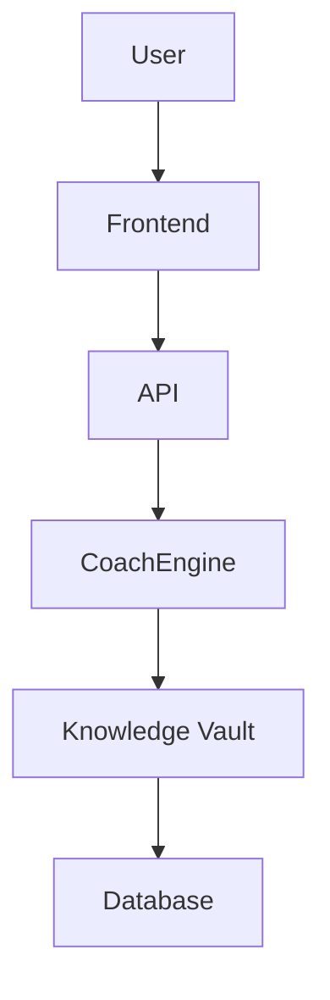

# Phase 9: Documentation & Project Finalization

**Status**: 📝 READY TO START  
**Started**: December 18, 2025  
**Objective**: Comprehensive documentation and project wrap-up

## Overview

Phase 9 focuses on documenting the entire ChessChatWeb project, creating user guides, architecture documentation, and ensuring the codebase is maintainable and deployable.

## Goals

1. **Complete Architecture Documentation**
2. **Create User Guides** (Admin & End-User)
3. **API Documentation** (all endpoints)
4. **Deployment Guide** (Cloudflare Pages)
5. **Maintenance Guide** (for future developers)
6. **Update README** with current state

## Documentation Deliverables

### 1. Architecture Documentation

#### 1.1 ARCHITECTURE.md
Complete system architecture overview:
- Frontend architecture (React + Vite)
- Backend architecture (Cloudflare Functions)
- Database schema (Prisma + D1)
- Knowledge Vault system
- CoachEngine design
- Authentication flow
- API design patterns

#### 1.2 COACHENGINE_ARCHITECTURE.md
Detailed CoachEngine documentation:
- System design
- Knowledge retrieval algorithm
- Relevance scoring logic
- Search strategies
- Coaching generation process
- Integration points
- Performance considerations

#### 1.3 KNOWLEDGE_VAULT_GUIDE.md
Knowledge management system:
- Structure and format
- How to add new knowledge
- Chunk creation guidelines
- Tagging best practices
- Import/export procedures
- Maintenance procedures

### 2. API Documentation

#### 2.1 API_REFERENCE.md
Complete API endpoint documentation:

**Public Endpoints**:
- GET /api/health
- POST /api/chess/move
- POST /api/chat
- GET /api/chess/analysis

**Admin Endpoints**:
- POST /api/admin/auth/unlock
- POST /api/admin/auth/logout
- GET /api/admin/knowledge/sources
- POST /api/admin/knowledge/sources
- GET /api/admin/knowledge/sources/{id}
- PATCH /api/admin/knowledge/sources/{id}
- DELETE /api/admin/knowledge/sources/{id}
- GET /api/admin/knowledge/sources/{id}/chunks
- POST /api/admin/knowledge/sources/{id}/chunks
- GET /api/admin/knowledge/diagnostics
- POST /api/admin/coach
- GET /api/admin/audit

Each endpoint documented with:
- HTTP method and path
- Request parameters
- Request body schema
- Response schema
- Example requests/responses
- Error codes
- Authentication requirements

#### 2.2 API_AUTHENTICATION.md
Authentication system documentation:
- Session token generation
- Token validation
- Admin password security
- Token expiration
- Best practices

### 3. User Guides

#### 3.1 USER_GUIDE.md
End-user documentation:
- How to play games
- Understanding game analysis
- Using post-game chat
- Interpreting coaching insights
- Settings and preferences
- Troubleshooting

#### 3.2 ADMIN_GUIDE.md
Administrator documentation:
- Accessing admin portal
- System health monitoring
- Knowledge Vault management
  - Adding sources
  - Creating chunks
  - Bulk import procedures
- CoachEngine testing
- Audit log review
- User management (future)

### 4. Developer Documentation

#### 4.1 DEVELOPER_GUIDE.md
For future developers:
- Project structure overview
- Development environment setup
- Running locally
- Testing procedures
- Code style guidelines
- Git workflow
- Common patterns
- Troubleshooting dev issues

#### 4.2 CONTRIBUTING.md
Contribution guidelines:
- How to contribute
- Code review process
- Testing requirements
- Documentation requirements
- Commit message format
- Branch naming conventions

### 5. Deployment Documentation

#### 5.1 DEPLOYMENT_GUIDE.md
Production deployment:
- Prerequisites
- Cloudflare Pages setup
- Environment variables
- Database migrations
- Knowledge base seeding
- DNS configuration
- SSL/TLS setup
- Monitoring setup
- Rollback procedures

#### 5.2 LOCAL_DEVELOPMENT.md
Local development setup:
- Prerequisites (Node.js, npm, etc.)
- Installation steps
- Running frontend (Vite)
- Running backend (Mock vs. Wrangler)
- Database setup (local D1)
- Environment configuration
- Common issues and solutions

### 6. Maintenance Documentation

#### 6.1 MAINTENANCE_GUIDE.md
Ongoing maintenance:
- Database backups
- Knowledge base updates
- Performance monitoring
- Log management
- Security updates
- Dependency updates
- Incident response

#### 6.2 TROUBLESHOOTING.md
Common issues and solutions:
- Build failures
- Runtime errors
- API connection issues
- Authentication problems
- Performance issues
- Database errors
- Coaching system issues

### 7. Project Documentation

#### 7.1 CHANGELOG.md
Version history:
- All phases documented
- Features added per phase
- Bug fixes
- Breaking changes
- Migration guides

#### 7.2 LICENSE.md
Software license information

#### 7.3 SECURITY.md
Security best practices:
- Reporting vulnerabilities
- Security considerations
- Authentication security
- Data protection
- API security
- CORS configuration

### 8. Update Existing Documentation

#### Update Files:
- **README.md**: Current state, features, quick start
- **PRISMA_IMPLEMENTATION_STATUS.md**: Mark all phases complete
- **QUICK_START.md**: Updated with Phase 8 features
- **PHASE_TESTING_REPORT.md**: Add Phase 7 & 8 results

## Documentation Standards

### Markdown Format
- Clear headings (H1, H2, H3)
- Code blocks with syntax highlighting
- Tables for structured data
- Diagrams (Mermaid) where appropriate
- Links to related docs
- Table of contents for long docs

### Code Examples
- Complete, runnable examples
- Commented for clarity
- Show expected output
- Include error handling
- Real-world scenarios

### Diagrams
Use Mermaid for:
- System architecture
- Data flow diagrams
- Sequence diagrams
- Entity relationships
- Deployment topology

Example:

## Implementation Checklist

### Architecture & Design
- [ ] ARCHITECTURE.md
- [ ] COACHENGINE_ARCHITECTURE.md
- [ ] KNOWLEDGE_VAULT_GUIDE.md
- [ ] System diagrams (Mermaid)
- [ ] Data flow documentation

### API Documentation
- [ ] API_REFERENCE.md (all endpoints)
- [ ] API_AUTHENTICATION.md
- [ ] Request/response examples
- [ ] Error code reference
- [ ] Postman collection (optional)

### User Documentation
- [ ] USER_GUIDE.md
- [ ] ADMIN_GUIDE.md
- [ ] Screenshots/GIFs
- [ ] Video tutorials (optional)
- [ ] FAQ section

### Developer Documentation
- [ ] DEVELOPER_GUIDE.md
- [ ] CONTRIBUTING.md
- [ ] Code style guide
- [ ] Testing guide
- [ ] Common patterns

### Deployment & Operations
- [ ] DEPLOYMENT_GUIDE.md
- [ ] LOCAL_DEVELOPMENT.md
- [ ] MAINTENANCE_GUIDE.md
- [ ] TROUBLESHOOTING.md
- [ ] Monitoring setup docs

### Project Documentation
- [ ] CHANGELOG.md
- [ ] LICENSE.md
- [ ] SECURITY.md
- [ ] Update README.md
- [ ] Update PRISMA_IMPLEMENTATION_STATUS.md

### Final Review
- [ ] All docs reviewed for accuracy
- [ ] All links tested
- [ ] Code examples tested
- [ ] Screenshots up to date
- [ ] Spelling and grammar check
- [ ] Consistent formatting

## Documentation Tools

### Recommended Tools:
- **Markdown Editor**: VS Code with Markdown extensions
- **Diagram Tool**: Mermaid (embedded in markdown)
- **Screenshot Tool**: Windows Snipping Tool, ShareX
- **GIF Recording**: ScreenToGif, LICEcap
- **API Documentation**: Swagger/OpenAPI (optional)
- **Spell Check**: VS Code spell checker extension

### VS Code Extensions:
- Markdown All in One
- Markdown Preview Enhanced
- Markdown Lint
- Spell Checker
- Mermaid Preview

## Timeline

### Day 1: Architecture & API (4 hours)
- Morning: Architecture docs
- Afternoon: API reference

### Day 2: User Guides (4 hours)
- Morning: User guide
- Afternoon: Admin guide

### Day 3: Developer Docs (4 hours)
- Morning: Developer guide
- Afternoon: Contributing guide

### Day 4: Deployment & Operations (4 hours)
- Morning: Deployment guide
- Afternoon: Maintenance & troubleshooting

### Day 5: Final Review & Polish (4 hours)
- Morning: Review all docs
- Afternoon: Update README, final polish

**Total Estimated Time**: 20 hours (1 work week)

## Success Criteria

- [ ] All deliverables created
- [ ] Documentation complete and accurate
- [ ] Code examples tested and working
- [ ] All links functional
- [ ] Consistent style across all docs
- [ ] Peer reviewed (if possible)
- [ ] User tested (clarity check)

## Post-Phase 9

After Phase 9, the project will be:
- ✅ Fully documented
- ✅ Ready for deployment
- ✅ Maintainable by new developers
- ✅ User-friendly for admins and players
- ✅ Production-ready

## Next Steps After Phase 9

1. **Production Deployment**
   - Deploy to Cloudflare Pages
   - Configure production database
   - Set up monitoring

2. **User Testing**
   - Beta testing with real users
   - Gather feedback
   - Iterate on UX

3. **Phase 10 (Optional): Advanced Features**
   - Player profiles
   - Game history
   - ELO ratings
   - Tournaments
   - Social features

---

**Ready to begin**: Phase 9 documentation can start immediately while Phase 8 is being implemented.
